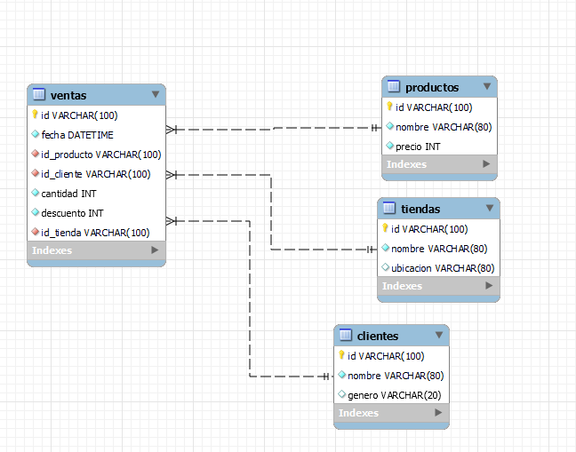

### Creación y visualiación de base de datos

En este trabajo se crea una base de datos a partir de información entregada en formato archivo.csv. Los datos son procesados y almacenados en una base de datos en MySQL siguiendo las tres reglas de normalización como se muestra en la imagen "Diagrama entidad relación". También se descargan las tablas en formato csv para ser cargadas a Big Query de forma paralela.


>Diagrama Entidad relación


# tiendaelectronicos.ipynb
Para ver el código abre el archivo:
##### [tiendaelectronicos.ipynb](https://github.com/SilvanaNavarro/minoristaelectronico.git/tiendaelectronicos.ipynb)

##Librerías utilizadas
- [Pandas](https://pandas.pydata.org/docs/)
- [Numpy](https://numpy.org/doc/)
- [Datetime](https://docs.python.org/3/library/datetime.html)
- [Mysql.connector](https://dev.mysql.com/doc/connector-python/en/)

##Lenguajes utilizados
- [Python](https://docs.python.org/3/)
- [SQL](https://dev.mysql.com/doc/refman/8.3/en/language-structure.html)

##Descripción del código
                                
----

###MySQL
En la terminal se crea la base de datos
`mysql>CREATE DATABASE minoristaelectronicos;`

En esta DB se trabajará, creando las tablas, estableciendo las relaciones entre ellas y cargando los datos extraídos.
Se crean las tablas siguiendo el siguiente formato y según el diagrama presentado en la imagen "Diagrama Entidad Relación".
`mysql>CREATE TABLE IF NOT EXISTS nombreTabla (columna1 TYPE(99) NOT NULL, columna2 TYPE(99),...,columnaN TYPE(99) ,PRIMARY KEY (columnaX))`


###Python
El código está dividido en funciones como se presenta a continuación:

#####- Importación de librerías

```Python
import pandas as pd
import numpy as np
from datetime import datetime
import mysql.connector
from mysql.connector import Error
```


- Función de extracción de datos desde archivo csv

```python
def extraer_datos(ruta_de_archivo): 
    archivo=pd.read_csv(ruta_de_archivo)
    data_frame=pd.DataFrame(archivo)
    return(data_frame)
```
#####- Función de transformación de datos considera:
1. Separación de datos en tablas, según diagrama de entidad-relación.
2. Transformación de formatos.

Dato origen  | Dato salida
------------- | -------------
fecha STRING  | fecha DATETIME
hora STRING  | fecha DATETIME
precio STRING | precio INT
descuento STRING | descuento INT

Junto con esto se calcula el precio individual por producto_id para almacenar en la tabla productos.

- Función de conexión a base de datos.
Con esta función se cargan datos a tablas. 
Requiere:
1. Sentencia SQL.
2. Nombre de tabla.

#####- Finalmente las funciones son llamadas para hacer todas las acciones en el siguiente orden:
1. Declaración de ruta de archivo origen.
2. Llamar función extraer_datos.
3. Almacenar tablas (DataFrames) al llamar la función transformación.
4. Creación de tablas en base de datos (Conexión MySQL).
5. Carga de datos a DB.
6. (Opcional) Ejecutar para descargar tablas en formato CSV.